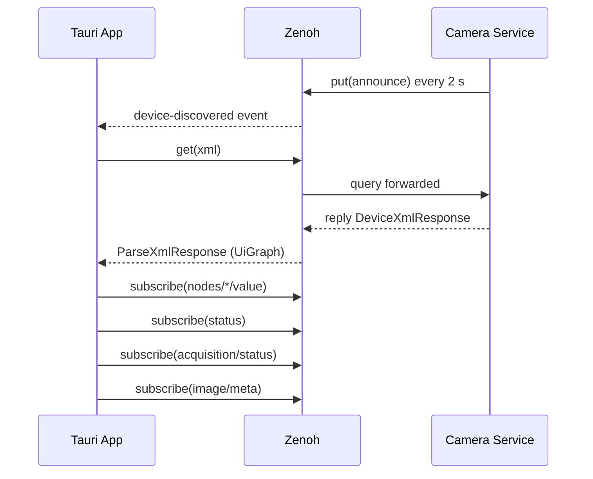
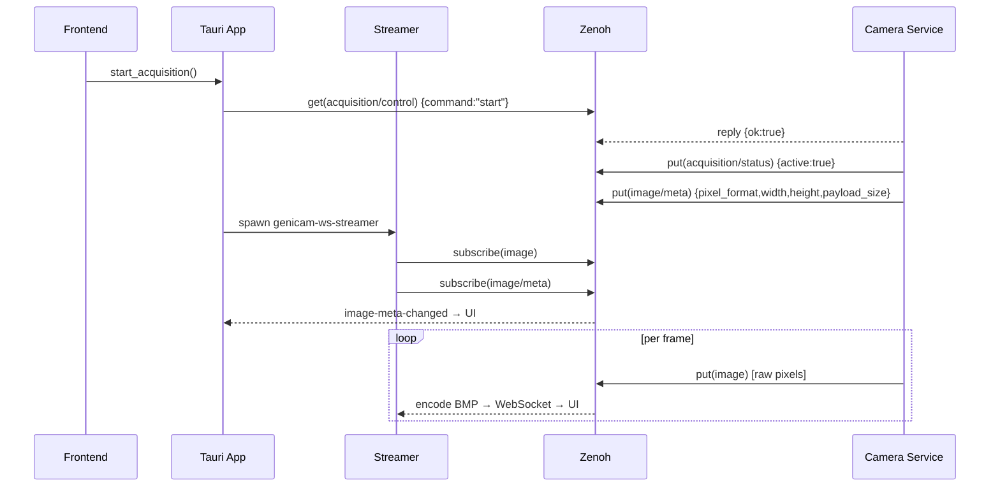

# ZA-07: API Spec Review & Documentation

## Spec

**What:** Bring `docs/zenoh-api.md` fully in sync with `genicam_zenoh_api` — add the missing `image/meta` section, fix the `image` payload description (no longer Mono8-only), add `image-meta-changed` to the Tauri events table, add the `image/meta` row to the timing table, annotate every section with its Rust type name, and add Mermaid sequence diagrams for the device-connect and acquisition flows.

**Why:** The spec is the contract between this repo, the external camera service, and future contributors; gaps and stale descriptions cause integration errors and slow down new feature work (ZA-04, ST-02, ST-03 all depend on an accurate spec).

**Files touched:**
- `docs/zenoh-api.md` — add `image/meta` section; fix `image` payload; add Rust type annotations; add timing table row; add Tauri event row; add two Mermaid sequence diagrams
- `CHANGELOG.md` — add one-line entry under `[Unreleased]`

**Key decisions:**
- The `image/meta` section must state both consumers explicitly (Tauri via TB-01, streamer via ST-01) because the direction is "Service → App and Streamer" — neither consumer is optional.
- `PixelFormat` variants should not be enumerated inline in the spec; reference the enum name and list the four formats currently generated by the mock service (`Mono8`, `Mono16`, `BayerRG8`, `RGB8`) with a note that the full set is defined in `genicam_zenoh_api::PixelFormat`.
- `payload_size` semantics must be stated precisely: `width × height × bytes_per_pixel` where `bytes_per_pixel` is `1.0` for Mono8/BayerXX8, `2.0` for Mono10/12/16/BayerXX10/12/16 and YCbCr422_8, `3.0` for RGB8/BGR8/YCbCr8, `4.0` for RGBa8. The `PixelFormat::bytes_per_pixel()` method is authoritative.
- Sequence diagrams use Mermaid `sequenceDiagram` blocks (GitHub renders natively). Keep diagrams to ≤10 steps each — prefer clarity over completeness.
- Do not add a `**Rust type:**` bullet to `image` (raw bytes, not JSON) — instead note "no JSON encoding; raw pixel bytes".

**Unit tests required:** None — documentation-only task, no new code.

**CHANGELOG entry:** `- ZA-07: Zenoh API spec reviewed; added image/meta section, sequence diagrams, Rust type references, and corrected image payload description`

---

## Gaps Found (implementation checklist)

### Critical — `image/meta` key entirely missing from spec

Add a new subsection under the Acquisition section, immediately after `image`:

```markdown
### `genicam/devices/{device_id}/image/meta`

- **Direction:** Service → App and Streamer
- **Mechanism:** `put` on acquisition start; re-published whenever Width, Height,
  or PixelFormat node values change while acquisition is active
- **Consumers:**
  - **genicam-ws-streamer** (ST-01): subscribes to reconfigure its BMP encoder when
    dimensions change.
  - **Tauri app** (TB-01): subscribes and stores the latest value in
    `AcquisitionInner.image_meta`; emits `image-meta-changed` event to the frontend.
- **Payload (JSON):**
  ```json
  { "pixel_format": "Mono8", "width": 1920, "height": 1080, "payload_size": 2073600 }
  ```
- **Rust type:** `ImageMeta` in `genicam_zenoh_api`.
- **Field notes:**
  - `pixel_format` — SFNC format string (e.g. `"Mono8"`, `"Mono16"`, `"BayerRG8"`,
    `"RGB8"`). Full variant list: `genicam_zenoh_api::PixelFormat`. Unknown strings
    deserialize as `PixelFormat::Unknown`.
  - `payload_size` — `width × height × bytes_per_pixel` for the given format.
    See `PixelFormat::bytes_per_pixel()` for the authoritative mapping.
```

### High — `image` payload description is stale (Mono8-only)

Replace: `Raw binary Mono8 image (width × height bytes, row-major)`
With: `Raw binary pixel data, row-major. Format and dimensions are described by the co-published image/meta key. Currently generated formats: Mono8 (1 byte/px), Mono16 (2 bytes/px, little-endian), BayerRG8 (1 byte/px), RGB8 (3 bytes/px). Not JSON — no encoding wrapper.`

### Medium — Tauri Events table missing `image-meta-changed`

Add row:
```
| `image-meta-changed` | `ImageMeta` | Image format or dimension change; emitted by TB-01 on each image/meta Zenoh update |
```

### Medium — Timing table missing `image/meta`

Add row:
```
| `image/meta` | On acquisition start; on Width, Height, or PixelFormat change during active acquisition |
```

### Medium — Rust type names missing throughout

Add `**Rust type:**` bullet to these sections (all types are in `genicam_zenoh_api`):
- `announce` → `DeviceAnnounce`
- `status` → `DeviceStatus`
- `xml` → response: `DeviceXmlResponse`
- `nodes/{name}/value` → `NodeValueUpdate`
- `nodes/{name}/set` → request: `NodeSetRequest`; response: `NodeOpResponse`
- `nodes/{name}/execute` → response: `NodeOpResponse`
- `nodes/bulk/read` → request: `BulkReadRequest`; response: `BulkReadResponse`
- `acquisition/control` → request: `AcquisitionControlRequest { command: AcquisitionCommand }`; `AcquisitionCommand` serializes as `"start"` or `"stop"` (`#[serde(rename_all = "lowercase")]`)
- `acquisition/status` → `AcquisitionStatus`

### Low — Sequence diagrams missing entirely

Add a "Sequence Diagrams" section between "Error Semantics" and "Tauri IPC Commands".

**Diagram A — Device Connect:**


**Diagram B — Acquisition:**


---

## Implementation

**Files changed:**
- `docs/zenoh-api.md` — added `image/meta` subsection (direction, consumers, payload example, Rust type, field notes); fixed `image` payload description (was Mono8-only, now format-agnostic with currently generated formats listed); added `**Rust type:**` bullets to all key sections (`announce`, `status`, `xml`, `nodes/{name}/value`, `nodes/{name}/set`, `nodes/{name}/execute`, `nodes/bulk/read`, `acquisition/control`, `acquisition/status`); added `image-meta-changed` row to Tauri Events table; added `image/meta` row to Timing Guarantees table; added Sequence Diagrams section with Device Connect and Acquisition Mermaid diagrams.
- `CHANGELOG.md` — added one-line entry under `[Unreleased] > ### Added`

**Tests added:** none — documentation-only task, no new pure functions introduced

**Deviations from spec:** none

**CHANGELOG:** Added `- ZA-07: Zenoh API spec reviewed; added image/meta section, sequence diagrams, Rust type references, and corrected image payload description` under [Unreleased]

## Review

**Gate results:**
| Gate | Result |
|------|--------|
| cargo fmt | SKIP (documentation-only task, no Rust files changed) |
| cargo clippy | SKIP (documentation-only task, no Rust files changed) |
| cargo test | SKIP (documentation-only task, no Rust files changed) |
| bun run build | SKIP (no UI files changed) |

**Issues found:** Blocking: 0 · Important: 0 · Minor: 0

**Completeness — all 11 keys from `genicam_zenoh_api::keys` verified:**
- `announce` — documented (Discovery section)
- `xml` — documented (Connection Lifecycle section)
- `status` — documented (Connection Lifecycle section)
- `node_value` — documented (`nodes/{node_name}/value`)
- `node_set` — documented (`nodes/{node_name}/set`)
- `node_execute` — documented (`nodes/{node_name}/execute`)
- `nodes_bulk_read` — documented (`nodes/bulk/read`)
- `acquisition_control` — documented
- `acquisition_status` — documented
- `image` — documented
- `image_meta` — documented (`image/meta` subsection with direction, consumers, JSON example, Rust type, field notes)

**Accuracy cross-check against `crates/genicam_zenoh_api/src/lib.rs`:**
- `ImageMeta` example has all four fields (`pixel_format`, `width`, `height`, `payload_size`) in snake_case — matches struct at lib.rs:165-170. PASS.
- `BulkReadResponse` example uses `values` key — matches field at lib.rs:72. PASS.
- `DeviceAnnounce` example uses `id`, `name`, `model`, `serial` — matches struct at lib.rs:12-17. PASS.
- `PixelFormat` variants serialize as PascalCase Rust names (no `rename_all` on the enum) — example `"Mono8"` is correct. PASS.
- `AcquisitionCommand` serializes as lowercase (`#[serde(rename_all = "lowercase")]` at lib.rs:84) — example `"start"` / `"stop"` is correct. PASS.
- `NodeValueUpdate` example uses `value` and `access_mode` — matches lib.rs:38-41. PASS.

**Structure and required items:**
- `image/meta` subsection: direction, consumers (both Tauri TB-01 and Streamer ST-01), trigger conditions, JSON example — all present. PASS.
- `image-meta-changed` row in Tauri Events table — present with `ImageMeta` payload type. PASS.
- `image/meta` row in Timing Guarantees table — present. PASS.
- Sequence Diagrams section: present with two `sequenceDiagram` Mermaid blocks (Device Connect and Acquisition). PASS.
- Both diagrams start with `sequenceDiagram` keyword and use valid `-->>` / `->>` arrow syntax. PASS.
- CHANGELOG entry under `[Unreleased]` matches the required text exactly. PASS.

**Unit test coverage:** N/A — documentation-only task, no new pure functions introduced.

**Verdict:** Ready to commit
